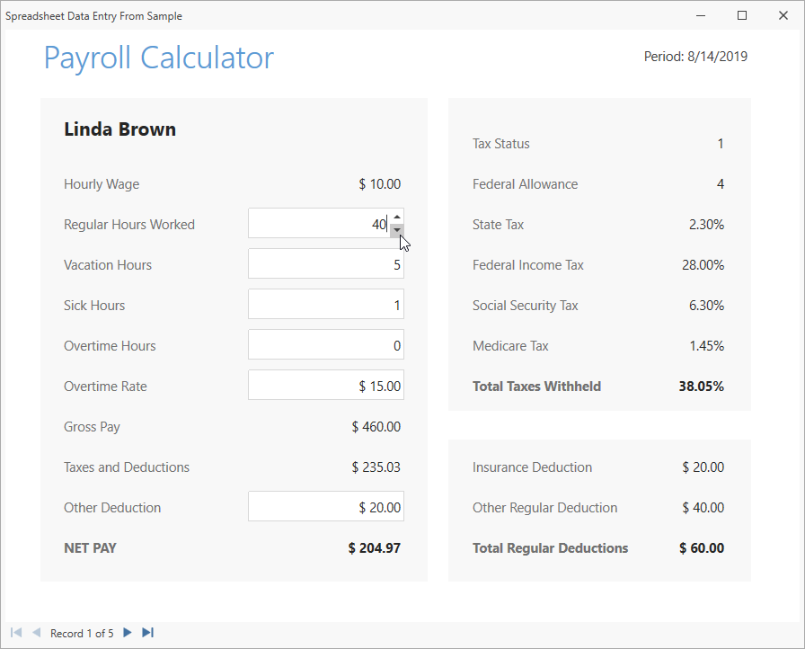

# How to Use SpreadsheetControl to Create a Data Entry Form

*Files to look at*:

* [MainWindow.xaml](./CS/WpfDataEntryFormSample/MainWindow.xaml) (VB: [MainWindow.vb](./VB/WpfDataEntryFormSample/MainWindow.xaml))
* [PayrollModel.cs](./CS/WpfDataEntryFormSample/PayrollModel.cs) (VB: [PayrollModel.vb](./VB/WpfDataEntryFormSample/PayrollModel.vb))
* [PayrollData.cs](./CS/WpfDataEntryFormSample/PayrollData.cs) (VB: [PayrollData.vb](./VB/WpfDataEntryFormSample/PayrollData.vb))
* [PayrollViewModel.cs](./CS/WpfDataEntryFormSample/PayrollViewModel.cs) (VB: [PayrollViewMode.vb](./VB/WpfDataEntryFormSample/PayrollViewModel.vb))
* [SpreadsheetBindingManager.cs](./CS/WpfDataEntryFormSample/SpreadsheetBindingManager.cs) (VB: [SpreadsheetBindingManager.vb](./VB/WpfDataEntryFormSample/SpreadsheetBindingManager.vb))

The following code example shows how to use the SpreadsheetControl to to create a payroll data entry form. Users can enter payroll information (regular and overtime hours worked, sick leave and vacation hours, overtime pay rate and deductions). Once data is entered, the Spreadsheet automatically calculates an employee’s pay and payroll taxes. The data navigator at the bottom of the application allows you to switch between employees.

[Refer to another repository for a WinForms code sample project](https://github.com/DevExpress-Examples/how-to-use-spreadsheet-control-to-create-a-data-entry-form)
